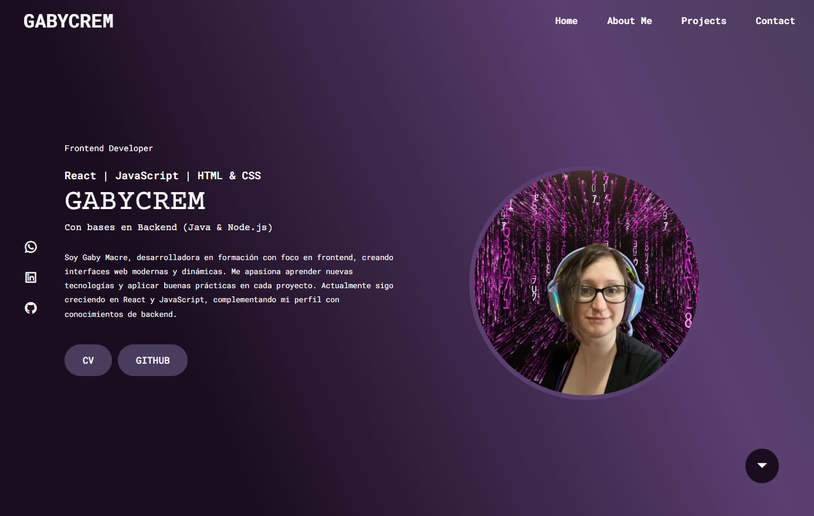

 <h1 align="center">Mi Landing Page - GABYCREM</h1>

# Proyecto Final - Landing Page Personal

Esta landing page está desarrollada con **HTML y CSS** como parte del cierre de la etapa inicial de Frontend del trayecto formativo en **Programación Web Full Stack** de **Digital House**, donde estoy becada.  

El diseño presenta mi perfil como **Frontend Developer** a través de un hero personal, un menú de navegación responsive y enlaces a mis redes de contacto.


## Características principales
- Menú de navegación responsive con el *checkbox hack* (sin necesidad de JavaScript).  
- Hero con presentación, foto y enlaces directos a **CV** y **GitHub**.  
- Iconos sociales interactivos (WhatsApp, LinkedIn y GitHub).  
- Efectos de hover en botones, iconos e imagen de perfil.  
- Diseño con **gradiente de fondo** y tipografías personalizadas (Google Fonts).  


## Tecnologías utilizadas
- **HTML5**  
- **CSS3**  
- **Boxicons & Remixicon** (para iconos)  
- **Google Fonts** (Courier Prime y Roboto Mono)  


## Estructura del proyecto


```
 /proyectoFinal
 ├── assets/
 │   ├── img/  # (Opcional) Carpeta para imágenes
 │      ├── img.jpg # Archivo de imagen vacio por ahora
 ├── index.html  # Página principal
 ├── README.md  # Documentación del proyecto
 ├── styles.css  # Archivo de estilos
```

## Vista previa




## Demo en línea
[Vercel](#)


## Autor
**Gabycrem®**  

- GitHub: [Gabycrem](https://github.com/Gabycrem)  
- LinkedIn: [Nazarena Macre](https://www.linkedin.com/in/macrenazarena/)  

---

<p align="center">`Siempre construyendo, siempre aprendiendo. -- GABYCREM®`</p>
